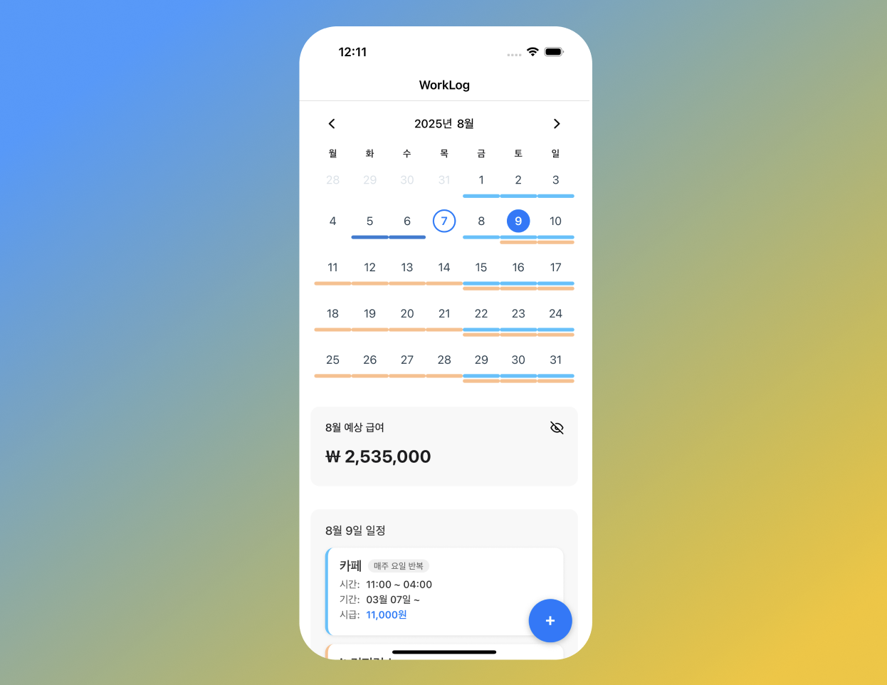

# 📱 WorkLogApp



React Native로 개발된 근무 일정 관리 앱입니다. 스케줄 생성, 수정, 삭제 및 수익 계산 기능을 제공하며, Zustand + MMKV를 사용한 영구 저장 기능을 포함합니다.

## 주요 기능

### 📅 스케줄 관리

- **유연한 반복 설정**: 일별, 주별, 월별 반복 스케줄 생성
- **다양한 급여 형태**: 시급, 일급, 월급 지원
- **스케줄 수정**: 언제든지 스케줄 수정 및 삭제

### 💰 수익 계산

- **월별 총 수익**: 자동으로 월별 수익 집계
- **급여 형태 변환**: 시급 기반 일급 자동 계산

### 💾 영구 저장 (Zustand + MMKV)

- **영구 저장**: 앱 종료 후에도 모든 데이터 안전 보관
- **고성능 저장소**: MMKV를 활용한 빠른 데이터 접근
- **자동 동기화**: 상태 변경 시 즉시 저장

## 🛠 기술 스택

### Frontend

- **React Native 0.80.2** - 크로스 플랫폼 모바일 앱
- **TypeScript 5.0.4** - 타입 안전성 보장
- **React 19.1.0** - 최신 React 기능 활용

### 상태 관리 & 저장소

- **Zustand 5.0.6** - 가벼운 상태 관리
- **MMKV 3.2.0** - 고성능 네이티브 저장소
- **React Navigation 7.x** - 네비게이션

### UI/UX

- **React Native Calendars 1.1312.1** - 달력 UI
- **React Native Modal 14.0.0** - 모달 컴포넌트
- **React Native Popup Menu 0.18.0** - 팝업 메뉴
- **Date-fns 4.1.0** - 날짜 처리 라이브러리

### 개발 환경

- **Expo 53.0.20** - 개발 및 빌드 플랫폼
- **ESLint & Prettier** - 코드 품질 관리

## 🚀 설치 및 실행

### 필수 요구사항

- Node.js 18.0.0 이상
- npm 또는 yarn
- Expo CLI
- iOS Simulator (macOS) 또는 Android Emulator

### 설치 과정

```bash
# 1. 저장소 클론
git clone [repository-url]
cd WorkLogApp

# 2. 의존성 설치
npm install

# 3. Expo 개발 서버 시작
npm start

# 4. 플랫폼별 실행
npm run ios      # iOS 시뮬레이터
npm run android  # Android 에뮬레이터
npm run web      # 웹 브라우저
```

## 📱 앱 사용법

### 1. 스케줄 생성

- 메인 화면에서 "+" 버튼 클릭
- 근무 날짜, 시간, 급여 정보 입력
- 반복 설정 (일별/주별/월별) 선택
- 저장 버튼으로 스케줄 생성

### 2. 수익 확인

- 달력에서 일별 수익 확인
- 월별 총 수익은 상단 카드에서 확인
- 수익 트렌드 및 통계 제공

### 3. 데이터 관리

- 앱 하단의 "스케줄 저장 테스트" 섹션 활용
- 데이터 백업 및 복원 기능
- 저장 상태 실시간 확인

## 🏗 프로젝트 구조

```
WorkLogApp/
├── src/
│   ├── components/          # 재사용 가능한 UI 컴포넌트
│   │   ├── CalendarDisplayItem.tsx
│   │   ├── CalendarPage.tsx
│   │   ├── DatePicker.tsx
│   │   ├── EarningsCard.tsx
│   │   ├── NewSessionModal.tsx
│   │   └── ...
│   ├── hooks/              # zustand 상태 변경 이전에 거치는 비즈니스 로직 커스텀 React 훅
│   │   └── useScheduleManager.ts
│   ├── models/             # TypeScript 타입 정의
│   │   └── WorkSession.ts
│   ├── screens/            # 앱 화면 컴포넌트
│   │   └── HomeScreen.tsx
│   ├── store/              # Zustand 상태 관리
│   │   ├── dateStore.ts
│   │   └── shiftStore.ts
│   ├── utils/              # 유틸리티 함수
│   │   ├── calendarFns.ts
│   │   ├── wageFns.ts
│   │   └── ...
│   └── data/               # 목데이터
│       └── mockSchedules.ts
├── android/                # Android 네이티브 코드
├── ios/                    # iOS 네이티브 코드
└── assets/                 # 이미지 및 아이콘
```

### 상태 관리 (Zustand + MMKV)

```typescript
// 스케줄 추가
const { addSchedule } = useScheduleManager();
addSchedule(newSchedule);

// 스케줄 수정
const { updateSchedule } = useScheduleManager();
updateSchedule(id, { ...updatedSchedule });

// 데이터 복원
const { deleteSchedule } = useScheduleManager();
deleteSchedule(id);
```

## 🧪 테스트

앱 하단의 "스케줄 저장 테스트" 섹션에서 다음 기능을 테스트할 수 있습니다:

- ✅ **테스트 스케줄 추가**: 샘플 스케줄 생성
- ✅ **저장 상태 확인**: 현재 저장된 데이터 확인
- ✅ **데이터 백업**: JSON 형태로 데이터 내보내기
- ✅ **앱 재시작 테스트**: 앱 종료 후 재실행하여 데이터 유지 확인
